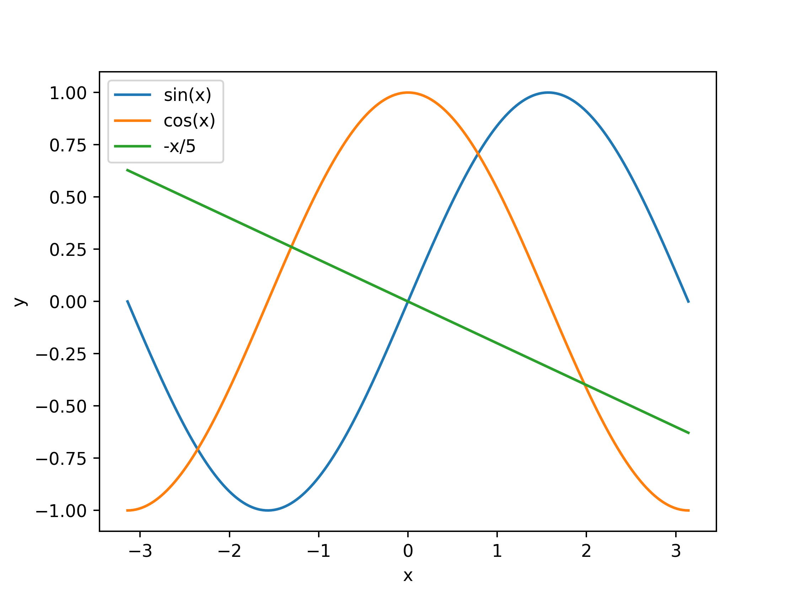

# Exercise Sheet 01
### Exercise 5
- top: Displays Linux processes,  ps: report a snapshot of current processes and -u: filters the processes by user. With '>' and '<' you can move the sort field to right or left. In additon there are shortcuts for the specific fields. 
	- command  | sorted-field      
	------------|--------------
	A| start time (non-display)
      M| %MEM
	N| PID
	P | %CPU
	T | TIME+
- delays something for a specific amount of time. i.e for 10 second
- pwd: print name of current directory, ls: list directory content, cd: change directory, cp: copy files and directories, ln: create links between files.
- __HAND-IN__ It contains 2D coordinates which create the words _Welcome to HPC_ if plotted. 
- y is printed over and over again. yes: outputs a string repeatedly until killed. 'kill -9' command sends a kill signal to terminate any process immediately. 'kill -SIGKILL \<processID\>' has the same effect
- The processes are runnig the background. With jobs you can find the id of the job which is running in the background. In used the command kill %\<job id\>
- echo: displays a line of text. It prints 'Hello World', user: 'dennys', shell: 'zsh', hostname: 'fedora' $VAR are global variables inside the shell.
- df: how much space in a directory: i.e. 941271280
- __HAND-IN__ 
### Exercise 6
- __HAND-IN__ : 
	- My_file: newlines:5, words: 5, byte counts: 24
	- Data.txt with My_file appended: newlines: 1728, words: 3451 byte counts: 67379
