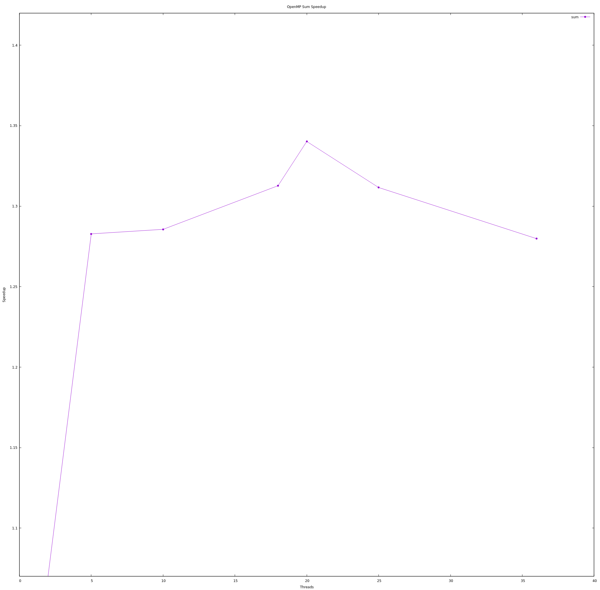

# Exercise Sheet 03 (Dennys Huber)
## Exercise 01
- You can find the execution times of the different flags [here](https://github.com/devnnys/hpc_esc_401_solutions/blob/359aeb1c611b970cec6ec782ee461570ee2f0be8/exercise_session_03/exercise_01/output.log)
- The MPI_Wtime function has a better precision due to it being integrated with MPI, our time measurement with get_times, also measures other function calls which are executed during the programm.

## Exercise 02
- You can find an result and timings of the different flags [here](https://github.com/devnnys/hpc_esc_401_solutions/blob/359aeb1c611b970cec6ec782ee461570ee2f0be8/exercise_session_03/exercise_02/time.dat)
 - Another way to get a timing is to use the 'time' program inside your terminal.
 - From to the O0 to O1 the improvement is the biggest by roughly 5 seconds. Between 'O1' and 'O2' it's  0.04 and the difference from 'O2' to '03' is 0.02
 - The compiler tries to reduce the code size and execution time by rewriting our code with expressions that are easier to execute on a computer or use less operations. It also disable certain option which would take longer to compile like a more expressive debuging output or certain unneeded side effects of function are not called. 
 - You could add parallelize it or add flags like --fastmath
 - I added the line right above the loop.
 - I needed to add the -fopenmp flags to the usual compile command: 
```bash
cc -O3 -o sum sum.c get_time.c -fopenmp
```
- The job script can be found [here](https://github.com/devnnys/hpc_esc_401_solutions/blob/main/exercise_session_03/exercise_02/cpi_omp_sbatch)
 - GNU-Plot: 
The Speedup plot clearly shows that the speedup is not linear and speed gain after a certain point is decreasing. Usually this is caused by the time it takes to communicate with the big memory all the threads are using. Distance could be issue between the memory and cpu or how a certain thread is able to access the memory resp. is the the data it needs for the next calculation already there?

## Exercise 03
- This behaviour is usually caused by a process that only needs to exchange information between its cpu and its cache. 